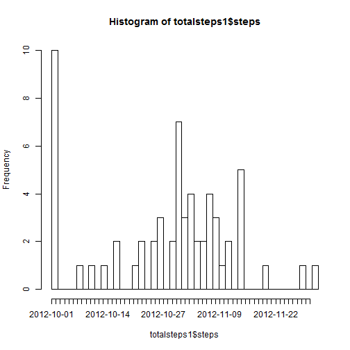
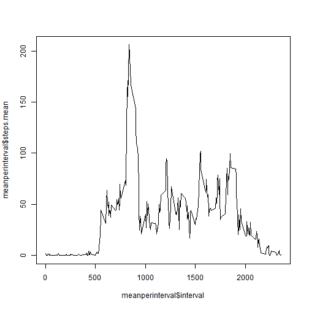
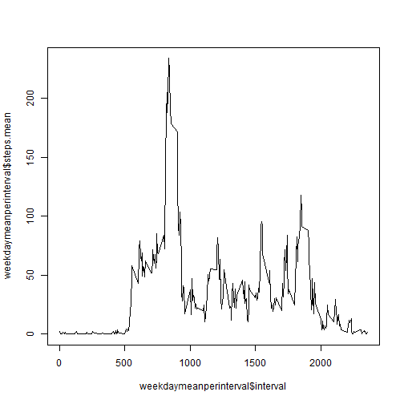
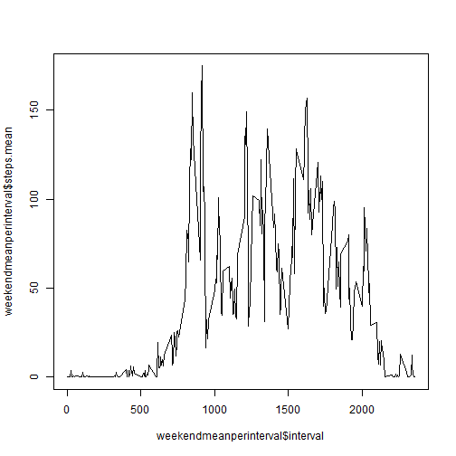

####Activity Monitoring Device Data Analysis

It is now possible to collect a large amount of data about personal movement using activity monitoring devices such as a Fitbit, Nike Fuelband, or Jawbone Up. These type of devices are part of the “quantified self” movement – a group of enthusiasts who take measurements about themselves regularly to improve their health, to find patterns in their behavior, or because they are tech geeks. But these data remain under-utilized both because the raw data are hard to obtain and there is a lack of statistical methods and software for processing and interpreting the data.


This assignment makes use of data from a personal activity monitoring device. This device collects data at 5 minute intervals through out the day. The data consists of two months of data from an anonymous individual collected during the months of October and November, 2012 and include the number of steps taken in 5 minute intervals each day.

Let's read data

```r
activitydata <- read.csv("activity.csv")
```


Step #2: Let's find mean total number of steps taken per day


```r
totalsteps1 <- aggregate(activitydata$steps, by = list(activitydata$date), FUN = sum, 
    na.rm = TRUE)
names(totalsteps1) <- c("date", "steps")
totalsteps1$date <- as.Date(totalsteps1$date, "%Y-%m-%d")
```


And then plot them on chart

```r
hist(totalsteps1$steps, breaks = nrow(totalsteps1), axes = F)
axis(1, at = seq(1, max(totalsteps1$steps), max(totalsteps1$steps)/nrow(totalsteps1)), 
    labels = totalsteps1$date)
axis(2)
```

 


Finding mean and median of steps taken per day

```r
meanperdate <- aggregate(activitydata$steps, by = list(activitydata$date), FUN = mean, 
    na.rm = TRUE)
names(meanperdate) <- c("date", "steps.mean")
```

Mean of steps on per day basis:

```r
meanperdate
```

```
##          date steps.mean
## 1  2012-10-01        NaN
## 2  2012-10-02     0.4375
## 3  2012-10-03    39.4167
## 4  2012-10-04    42.0694
## 5  2012-10-05    46.1597
## 6  2012-10-06    53.5417
## 7  2012-10-07    38.2465
## 8  2012-10-08        NaN
## 9  2012-10-09    44.4826
## 10 2012-10-10    34.3750
## 11 2012-10-11    35.7778
## 12 2012-10-12    60.3542
## 13 2012-10-13    43.1458
## 14 2012-10-14    52.4236
## 15 2012-10-15    35.2049
## 16 2012-10-16    52.3750
## 17 2012-10-17    46.7083
## 18 2012-10-18    34.9167
## 19 2012-10-19    41.0729
## 20 2012-10-20    36.0938
## 21 2012-10-21    30.6285
## 22 2012-10-22    46.7361
## 23 2012-10-23    30.9653
## 24 2012-10-24    29.0104
## 25 2012-10-25     8.6528
## 26 2012-10-26    23.5347
## 27 2012-10-27    35.1354
## 28 2012-10-28    39.7847
## 29 2012-10-29    17.4236
## 30 2012-10-30    34.0938
## 31 2012-10-31    53.5208
## 32 2012-11-01        NaN
## 33 2012-11-02    36.8056
## 34 2012-11-03    36.7049
## 35 2012-11-04        NaN
## 36 2012-11-05    36.2465
## 37 2012-11-06    28.9375
## 38 2012-11-07    44.7326
## 39 2012-11-08    11.1771
## 40 2012-11-09        NaN
## 41 2012-11-10        NaN
## 42 2012-11-11    43.7778
## 43 2012-11-12    37.3785
## 44 2012-11-13    25.4722
## 45 2012-11-14        NaN
## 46 2012-11-15     0.1424
## 47 2012-11-16    18.8924
## 48 2012-11-17    49.7882
## 49 2012-11-18    52.4653
## 50 2012-11-19    30.6979
## 51 2012-11-20    15.5278
## 52 2012-11-21    44.3993
## 53 2012-11-22    70.9271
## 54 2012-11-23    73.5903
## 55 2012-11-24    50.2708
## 56 2012-11-25    41.0903
## 57 2012-11-26    38.7569
## 58 2012-11-27    47.3819
## 59 2012-11-28    35.3576
## 60 2012-11-29    24.4688
## 61 2012-11-30        NaN
```

```r
medianperdate <- aggregate(activitydata$steps, by = list(activitydata$date), 
    FUN = median, na.rm = TRUE)
names(medianperdate) <- c("date", "steps.median")
medianperdate
```

```
##          date steps.median
## 1  2012-10-01           NA
## 2  2012-10-02            0
## 3  2012-10-03            0
## 4  2012-10-04            0
## 5  2012-10-05            0
## 6  2012-10-06            0
## 7  2012-10-07            0
## 8  2012-10-08           NA
## 9  2012-10-09            0
## 10 2012-10-10            0
## 11 2012-10-11            0
## 12 2012-10-12            0
## 13 2012-10-13            0
## 14 2012-10-14            0
## 15 2012-10-15            0
## 16 2012-10-16            0
## 17 2012-10-17            0
## 18 2012-10-18            0
## 19 2012-10-19            0
## 20 2012-10-20            0
## 21 2012-10-21            0
## 22 2012-10-22            0
## 23 2012-10-23            0
## 24 2012-10-24            0
## 25 2012-10-25            0
## 26 2012-10-26            0
## 27 2012-10-27            0
## 28 2012-10-28            0
## 29 2012-10-29            0
## 30 2012-10-30            0
## 31 2012-10-31            0
## 32 2012-11-01           NA
## 33 2012-11-02            0
## 34 2012-11-03            0
## 35 2012-11-04           NA
## 36 2012-11-05            0
## 37 2012-11-06            0
## 38 2012-11-07            0
## 39 2012-11-08            0
## 40 2012-11-09           NA
## 41 2012-11-10           NA
## 42 2012-11-11            0
## 43 2012-11-12            0
## 44 2012-11-13            0
## 45 2012-11-14           NA
## 46 2012-11-15            0
## 47 2012-11-16            0
## 48 2012-11-17            0
## 49 2012-11-18            0
## 50 2012-11-19            0
## 51 2012-11-20            0
## 52 2012-11-21            0
## 53 2012-11-22            0
## 54 2012-11-23            0
## 55 2012-11-24            0
## 56 2012-11-25            0
## 57 2012-11-26            0
## 58 2012-11-27            0
## 59 2012-11-28            0
## 60 2012-11-29            0
## 61 2012-11-30           NA
```

Mediand of steps on per day basis:

```r
meanperdate
```

```
##          date steps.mean
## 1  2012-10-01        NaN
## 2  2012-10-02     0.4375
## 3  2012-10-03    39.4167
## 4  2012-10-04    42.0694
## 5  2012-10-05    46.1597
## 6  2012-10-06    53.5417
## 7  2012-10-07    38.2465
## 8  2012-10-08        NaN
## 9  2012-10-09    44.4826
## 10 2012-10-10    34.3750
## 11 2012-10-11    35.7778
## 12 2012-10-12    60.3542
## 13 2012-10-13    43.1458
## 14 2012-10-14    52.4236
## 15 2012-10-15    35.2049
## 16 2012-10-16    52.3750
## 17 2012-10-17    46.7083
## 18 2012-10-18    34.9167
## 19 2012-10-19    41.0729
## 20 2012-10-20    36.0938
## 21 2012-10-21    30.6285
## 22 2012-10-22    46.7361
## 23 2012-10-23    30.9653
## 24 2012-10-24    29.0104
## 25 2012-10-25     8.6528
## 26 2012-10-26    23.5347
## 27 2012-10-27    35.1354
## 28 2012-10-28    39.7847
## 29 2012-10-29    17.4236
## 30 2012-10-30    34.0938
## 31 2012-10-31    53.5208
## 32 2012-11-01        NaN
## 33 2012-11-02    36.8056
## 34 2012-11-03    36.7049
## 35 2012-11-04        NaN
## 36 2012-11-05    36.2465
## 37 2012-11-06    28.9375
## 38 2012-11-07    44.7326
## 39 2012-11-08    11.1771
## 40 2012-11-09        NaN
## 41 2012-11-10        NaN
## 42 2012-11-11    43.7778
## 43 2012-11-12    37.3785
## 44 2012-11-13    25.4722
## 45 2012-11-14        NaN
## 46 2012-11-15     0.1424
## 47 2012-11-16    18.8924
## 48 2012-11-17    49.7882
## 49 2012-11-18    52.4653
## 50 2012-11-19    30.6979
## 51 2012-11-20    15.5278
## 52 2012-11-21    44.3993
## 53 2012-11-22    70.9271
## 54 2012-11-23    73.5903
## 55 2012-11-24    50.2708
## 56 2012-11-25    41.0903
## 57 2012-11-26    38.7569
## 58 2012-11-27    47.3819
## 59 2012-11-28    35.3576
## 60 2012-11-29    24.4688
## 61 2012-11-30        NaN
```


Finding and ploting mean of steps taken per interval:

```r
meanperinterval <- aggregate(activitydata$steps, by = list(activitydata$interval), 
    FUN = mean, na.rm = TRUE)
names(meanperinterval) <- c("interval", "steps.mean")
plot(meanperinterval$interval, meanperinterval$steps.mean, type = "l")
```

 

Maximum mean out of all intervals is: 835

Number of rows containing NA values: 2304

Create new function to fill NA values with mean of steps taken for the day relevant to the row

```r
fillnas <- function(x) {
    for (i in 1:length(x)) {
        if (is.na(x[i, ]$steps)) {
            subset <- x[which(x$date == x[i, ]$date), ]
            tempmean <- mean(subset$steps, na.rm = T)
            x[i, ]$steps <- tempmean
        }
    }
    return(x)
}
```


Create new dataframe using above mentioned function

```r
datafilled <- fillnas(activitydata)
```


Calculate total number of steps per day after filling missing values and plot it:

```r
totalsteps2 <- aggregate(datafilled$steps, by = list(datafilled$date), FUN = sum, 
    na.rm = TRUE)
names(totalsteps2) <- c("date", "steps")
totalsteps2$date <- as.Date(totalsteps2$date, "%Y-%m-%d")
hist(totalsteps2$steps, breaks = nrow(totalsteps2), axes = F)
axis(1, at = seq(1, max(totalsteps2$steps), max(totalsteps2$steps)/nrow(totalsteps2)), 
    labels = totalsteps2$date)
axis(2)
```

 


Find mean and median of steps taken per day with new datframe:

```r
meanperdate1 <- aggregate(datafilled$steps, by = list(datafilled$date), FUN = mean, 
    na.rm = TRUE)
names(meanperdate1) <- c("date", "steps.mean")
```

Mean of steps taken per day with new dataframe: 


```r
meanperdate1
```

```
##          date steps.mean
## 1  2012-10-01        NaN
## 2  2012-10-02     0.4375
## 3  2012-10-03    39.4167
## 4  2012-10-04    42.0694
## 5  2012-10-05    46.1597
## 6  2012-10-06    53.5417
## 7  2012-10-07    38.2465
## 8  2012-10-08        NaN
## 9  2012-10-09    44.4826
## 10 2012-10-10    34.3750
## 11 2012-10-11    35.7778
## 12 2012-10-12    60.3542
## 13 2012-10-13    43.1458
## 14 2012-10-14    52.4236
## 15 2012-10-15    35.2049
## 16 2012-10-16    52.3750
## 17 2012-10-17    46.7083
## 18 2012-10-18    34.9167
## 19 2012-10-19    41.0729
## 20 2012-10-20    36.0938
## 21 2012-10-21    30.6285
## 22 2012-10-22    46.7361
## 23 2012-10-23    30.9653
## 24 2012-10-24    29.0104
## 25 2012-10-25     8.6528
## 26 2012-10-26    23.5347
## 27 2012-10-27    35.1354
## 28 2012-10-28    39.7847
## 29 2012-10-29    17.4236
## 30 2012-10-30    34.0938
## 31 2012-10-31    53.5208
## 32 2012-11-01        NaN
## 33 2012-11-02    36.8056
## 34 2012-11-03    36.7049
## 35 2012-11-04        NaN
## 36 2012-11-05    36.2465
## 37 2012-11-06    28.9375
## 38 2012-11-07    44.7326
## 39 2012-11-08    11.1771
## 40 2012-11-09        NaN
## 41 2012-11-10        NaN
## 42 2012-11-11    43.7778
## 43 2012-11-12    37.3785
## 44 2012-11-13    25.4722
## 45 2012-11-14        NaN
## 46 2012-11-15     0.1424
## 47 2012-11-16    18.8924
## 48 2012-11-17    49.7882
## 49 2012-11-18    52.4653
## 50 2012-11-19    30.6979
## 51 2012-11-20    15.5278
## 52 2012-11-21    44.3993
## 53 2012-11-22    70.9271
## 54 2012-11-23    73.5903
## 55 2012-11-24    50.2708
## 56 2012-11-25    41.0903
## 57 2012-11-26    38.7569
## 58 2012-11-27    47.3819
## 59 2012-11-28    35.3576
## 60 2012-11-29    24.4688
## 61 2012-11-30        NaN
```

```r
medianperdate1 <- aggregate(datafilled$steps, by = list(datafilled$date), FUN = median, 
    na.rm = TRUE)
names(medianperdate1) <- c("date", "steps.median")
```

Median of steps taken per day with new dataframe: 

```r
medianperdate1
```

```
##          date steps.median
## 1  2012-10-01           NA
## 2  2012-10-02            0
## 3  2012-10-03            0
## 4  2012-10-04            0
## 5  2012-10-05            0
## 6  2012-10-06            0
## 7  2012-10-07            0
## 8  2012-10-08           NA
## 9  2012-10-09            0
## 10 2012-10-10            0
## 11 2012-10-11            0
## 12 2012-10-12            0
## 13 2012-10-13            0
## 14 2012-10-14            0
## 15 2012-10-15            0
## 16 2012-10-16            0
## 17 2012-10-17            0
## 18 2012-10-18            0
## 19 2012-10-19            0
## 20 2012-10-20            0
## 21 2012-10-21            0
## 22 2012-10-22            0
## 23 2012-10-23            0
## 24 2012-10-24            0
## 25 2012-10-25            0
## 26 2012-10-26            0
## 27 2012-10-27            0
## 28 2012-10-28            0
## 29 2012-10-29            0
## 30 2012-10-30            0
## 31 2012-10-31            0
## 32 2012-11-01           NA
## 33 2012-11-02            0
## 34 2012-11-03            0
## 35 2012-11-04           NA
## 36 2012-11-05            0
## 37 2012-11-06            0
## 38 2012-11-07            0
## 39 2012-11-08            0
## 40 2012-11-09           NA
## 41 2012-11-10           NA
## 42 2012-11-11            0
## 43 2012-11-12            0
## 44 2012-11-13            0
## 45 2012-11-14           NA
## 46 2012-11-15            0
## 47 2012-11-16            0
## 48 2012-11-17            0
## 49 2012-11-18            0
## 50 2012-11-19            0
## 51 2012-11-20            0
## 52 2012-11-21            0
## 53 2012-11-22            0
## 54 2012-11-23            0
## 55 2012-11-24            0
## 56 2012-11-25            0
## 57 2012-11-26            0
## 58 2012-11-27            0
## 59 2012-11-28            0
## 60 2012-11-29            0
## 61 2012-11-30           NA
```


Add new factor variable to data frame to identify weekdays and weekends:

```r
datafilled$date <- as.Date(datafilled$date, "%Y-%m-%d")
datafilled[, "weekday"] <- as.factor(weekdays(datafilled$date))
datafilled <- transform(datafilled, weekday = ifelse(weekday %in% c("Saturday", 
    "Sunday"), "weekend", "weekday"))
```


Create two subset dataframes for ease of plotting them:

```r
weekdaydata <- datafilled[which(datafilled$weekday == "weekday"), ]
weekenddata <- datafilled[which(datafilled$weekday == "weekend"), ]
```


Find mean of steps taken per interval on weekdays and plot them:

```r
weekdaymeanperinterval <- aggregate(weekdaydata$steps, by = list(weekdaydata$interval), 
    FUN = mean, na.rm = TRUE)
names(weekdaymeanperinterval) <- c("interval", "steps.mean")
plot(weekdaymeanperinterval$interval, weekdaymeanperinterval$steps.mean, type = "l")
```

 


Find mean of steps taken per interval on weekends and plot them:

```r
weekendmeanperinterval <- aggregate(weekenddata$steps, by = list(weekenddata$interval), 
    FUN = mean, na.rm = TRUE)
names(weekendmeanperinterval) <- c("interval", "steps.mean")
plot(weekendmeanperinterval$interval, weekendmeanperinterval$steps.mean, type = "l")
```

 

